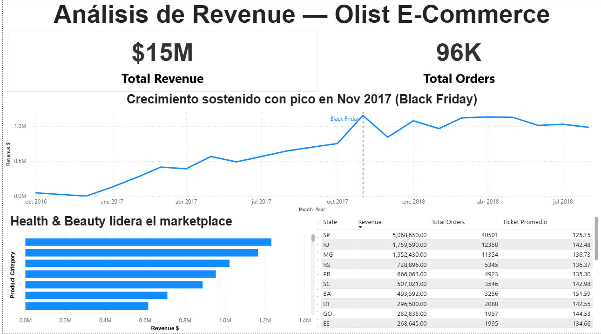

# 🛒 Análisis de E-Commerce Brasileño — Olist

**¿Qué categorías generaron más revenue? ¿Por qué el Nordeste falló en entregas? ¿Qué relación tuvo la logística con las reseñas de 1 estrella?**

Estas fueron las preguntas que me planteé al iniciar este proyecto. Las respondí analizando ~100K órdenes reales de Olist, el marketplace de e-commerce más grande de Brasil, usando SQL, PostgreSQL y Power BI.

---

## 📌 Por Qué Elegí Este Proyecto

Quería trabajar con un dataset de e-commerce real que me permitiera pensar como un analista embebido en un equipo de negocio — no solo ejecutar queries, sino formularme preguntas relevantes y traducir los datos en recomendaciones concretas.

Olist me pareció el contexto ideal: un marketplace con miles de vendedores, clientes distribuidos en todo Brasil y una operación logística compleja. Tres áreas críticas que en cualquier empresa de e-commerce pueden definir su éxito o fracaso:

1. **¿El revenue está bien distribuido?** — ¿Qué categorías realmente mueven el negocio y cuáles tienen potencial sin explotar?
2. **¿La operación de entregas es confiable?** — ¿Dónde se rompe la promesa logística y qué tan grave es?
3. **¿Los clientes están satisfechos?** — ¿Qué sellers o categorías están dañando silenciosamente la reputación del marketplace?

---

## 🎯 Objetivo

Convertir datos transaccionales de un e-commerce en insights accionables para las áreas de negocio, operaciones y producto — demostrando que el análisis de datos no termina en un número, sino en una decisión.

---

## 📊 Vista Previa del Dashboard

| Revenue | Operaciones y Entrega | Experiencia del Cliente |
|---|---|---|
|  |  |  |

---

## 🔍 Lo Que Encontré — y Lo Que Significa

### 💰 Módulo 1 — Revenue

**Health & Beauty lideró el revenue — pero no por precio, sino por volumen.**
Al analizar las categorías top, encontré que Health & Beauty generó ~$1.26M con 8,647 órdenes y un ticket promedio de ~$142. No era la categoría más cara — era la que más se compraba. Eso me indicó que la palanca de crecimiento aquí no era subir precios, sino estrategias de upselling y cross-selling para aumentar el valor por orden.

**El pico de noviembre 2017 no fue casualidad — fue Black Friday.**
Cuando vi el pico de revenue en noviembre 2017 en la serie temporal, lo primero que hice fue investigar el contexto externo. Coincidía exactamente con Black Friday y Hot Sale en Brasil. Eso confirmó que el comportamiento de compra en Olist sigue patrones estacionales del retail brasileño — información que cualquier equipo de operaciones debería anticipar con meses de preparación.

**`watches_gifts` tenía el ticket más alto (~$212) pero pocas órdenes.**
Identifiqué esta categoría como una oportunidad de adquisición desaprovechada. Cada cliente que llegaba aquí gastaba ~$200 en su primera compra. El volumen era bajo no por falta de demanda, sino probablemente por falta de visibilidad o inversión en marketing dirigido.

**`bed_bath_table` fue el hallazgo más preocupante del módulo.**
Era top 3 en revenue, pero al cruzarlo con el módulo de experiencia, también aparecía top 6 en insatisfacción. Una categoría de alto volumen con satisfacción media-baja es un riesgo silencioso: el revenue se sostiene hasta que los clientes dejan de regresar.

---

### 🚚 Módulo 2 — Operaciones y Entrega

**Descubrí que Olist prometía 23 días y entregaba en 12 — una estrategia deliberada.**
El promedio de entrega era ~11 días antes de la fecha estimada. Al principio pensé que era un error en los datos. Después entendí que era una estrategia intencional de gestión de expectativas: el cliente espera casi un mes y recibe en menos de dos semanas. Eso genera una percepción positiva sistemática.

**Pero el 9.6% que llegó tarde tenía retrasos severos — y 345 órdenes superaron los 30 días.**
El promedio favorable escondía un grupo de órdenes con retrasos extremos. Ese grupo era el verdadero problema operativo — concentrado, no distribuido, y por lo tanto atacable con intervenciones específicas.

**El Nordeste fue el talón de Aquiles logístico.**
Al segmentar el desempeño por estado, encontré un patrón consistente: AL, MA y PI concentraban los peores tiempos de entrega y las tasas más bajas de entrega a tiempo del país. No era un problema de sellers individuales — era un problema de infraestructura logística regional que requería soluciones estructurales: alianzas con operadores locales o centros de distribución en la zona.

**Cada retraso costaba aproximadamente 1.5 estrellas en el review score.**
Esta fue la conexión más importante del análisis. Al cruzar entregas tardías con calificaciones, la correlación fue clara: los pedidos que llegaron tarde recibieron en promedio 1.5 puntos menos. Mejorar la logística del Nordeste no era solo un problema operativo — era directamente un problema de reputación.

---

### ⭐ Módulo 3 — Experiencia del Cliente

**1 de cada 7 clientes tuvo una mala experiencia.**
Al analizar la distribución de review scores, encontré que el 14.7% calificó con 1 o 2 estrellas. Lo que más me llamó la atención fue el patrón: el score 1 aparecía con más frecuencia que el score 2. Los clientes insatisfechos no daban 2 estrellas — daban 1. Eso no habla de decepciones menores, sino de experiencias muy negativas.

**Encontré sellers con más del 65% de reseñas negativas.**
Al filtrar sellers con al menos 30 órdenes, identifiqué vendedores donde más de 2 de cada 3 clientes quedó insatisfecho. Mantenerlos activos en el marketplace significaba dañar el NPS global de Olist con cada orden que procesaban.

**`bed_bath_table` confirmó el riesgo cruzado que identifiqué en el módulo de revenue.**
Al ver esta categoría nuevamente en el top de insatisfacción, el patrón quedó claro: alto volumen + satisfacción media-baja = erosión silenciosa. Antes de seguir escalando su revenue, había que auditar sus sellers y tiempos de entrega específicos.

---

## 🧱 Arquitectura de Datos

Cargué los archivos CSV en **PostgreSQL 18.3** bajo un schema `raw` usando DBeaver. Organicé el análisis en módulos SQL progresivos y al final maticé los resultados como **vistas de PostgreSQL** — una capa intermedia que mantuvo la lógica de negocio separada del dashboard y simplificó la conexión con Power BI.

```
CSVs (Kaggle)
    ↓
PostgreSQL — schema raw
    ↓
SQL Analysis (4 módulos)
    ↓
PostgreSQL Views (capa semántica)
    ↓
Power BI Dashboard (Import mode)
```

**Vistas que creé para Power BI:**

| Vista | Descripción |
|---|---|
| `v_revenue_mensual` | Revenue mensual para órdenes entregadas |
| `v_revenue_categoria` | Revenue, volumen y ticket promedio por categoría |
| `v_revenue_estado` | Revenue y ticket promedio por estado del cliente |
| `v_entregas_estado` | Días de entrega, retraso y tasa on-time por estado |
| `v_satisfaccion_categoria` | Review score promedio y % de reseñas negativas por categoría |

---

## 🗂️ Estructura del Proyecto

```
olist-ecommerce-analysis/
│
├── README.md
│
├── data/
│   ├── olist_orders_dataset.csv
│   ├── olist_order_items_dataset.csv
│   ├── olist_order_payments_dataset.csv
│   ├── olist_order_reviews_dataset.csv
│   ├── olist_customers_dataset.csv
│   ├── olist_products_dataset.csv
│   ├── olist_sellers_dataset.csv
│   ├── olist_geolocation_dataset.csv
│   └── product_category_name_translation.csv
│
├── sql/
│   ├── 01_exploracion_tablas.sql       ← Inspección del esquema y conteo de filas
│   ├── 02_modulo_revenue.sql           ← Revenue por mes, categoría y estado
│   ├── 03_modulo_operaciones.sql       ← Desempeño de entregas y retrasos
│   ├── 04_modulo_experiencia.sql       ← Review scores, sellers y categorías
│   └── 05_vistas_dashboard.sql         ← Vistas de PostgreSQL para Power BI
│
├── powerbi/
│   └── OLIST_DASHBOARD.pbix
│
└── assets/
    ├── Vista_Revenue.png
    ├── Vista_Operaciones y Entrega.png
    └── Vista_Experiencia del Cliente.png
```

---

## 🔄 Cómo Reproducir el Análisis

### 1. Cargar los datos en PostgreSQL
- Crear una base de datos en PostgreSQL (ej. `olist_ecommerce`) con un schema `raw`
- Importar los 9 archivos `.csv` de la carpeta `/data/` usando DBeaver:
  `clic derecho en el schema → Import Data → seleccionar CSV`

### 2. Ejecutar los scripts SQL en orden
```
01_exploracion_tablas.sql   → validar estructura y filas
02_modulo_revenue.sql       → análisis de revenue
03_modulo_operaciones.sql   → análisis de entregas
04_modulo_experiencia.sql   → análisis de experiencia
05_vistas_dashboard.sql     → crear las vistas para Power BI
```

### 3. Conectar Power BI
- Abrir `OLIST_DASHBOARD.pbix` en Power BI Desktop
- Si las credenciales cambian: `Inicio → Transformar datos → Configuración de origen de datos`
- Actualizar host, puerto y credenciales de PostgreSQL según tu entorno local

---

## 🛠️ Stack Tecnológico

| Capa | Herramienta |
|---|---|
| Base de datos | PostgreSQL 18.3 |
| Cliente SQL | DBeaver 26.0 |
| Análisis | SQL (CTEs, Window Functions, agregaciones condicionales) |
| Visualización | Power BI Desktop (Import mode, medidas DAX) |
| Dataset | [Brazilian E-Commerce — Kaggle](https://www.kaggle.com/datasets/olistbr/brazilian-ecommerce) |

---

## 📐 Técnicas SQL que Apliqué

- Cadenas de `JOIN` sobre 5+ tablas simultáneas (orders → items → products → categories → payments → reviews)
- **CTEs** (`WITH`) para estructurar cálculos de entrega en múltiples pasos
- **Window functions** (`SUM() OVER()`, `COUNT() OVER()`) para calcular distribuciones porcentuales
- `FILTER (WHERE ...)` para agregaciones condicionales sin subqueries adicionales
- `NULLIF` + `EXTRACT` para aritmética de fechas segura sobre campos potencialmente vacíos
- `CASE WHEN` para clasificar entregas como a tiempo o tardías
- `CREATE OR REPLACE VIEW` para construir la capa semántica de Power BI

---

## ⚠️ Problemas de Calidad de Datos que Encontré

Traté la calidad de datos como una preocupación de primer nivel — no como algo que se ignora al final.

| Problema | Hallazgo | Decisión |
|---|---|---|
| Órdenes sin registro de pago | 1 NULL de ~97K órdenes entregadas (0.001%) | Insignificante — datos confiables para el análisis |
| Productos sin nombre de categoría | 1.41% de los order items | Por debajo del umbral del 2% — documenté como limitación menor |
| Caída de revenue Jul–Ago 2018 | El dataset termina a mediados de 2018 | No era una caída real — artefacto del corte del dataset |

---

## 👤 Autor

**Gerardo Vázquez Cruz** — Analista de datos, enfocado en convertir datos desordenados en decisiones claras de negocio.

- 🔗 [LinkedIn](https://linkedin.com/in/gerardo-vazquez-dataanalyst)
- 🐙 [GitHub](https://github.com/gerardovazquez-DataAnalyst)
- 📍 Altamira, México
